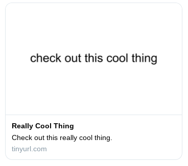
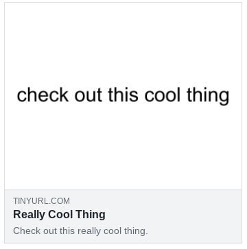
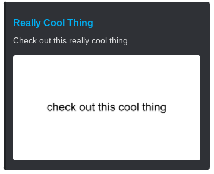

# RickHider
A website for generating hidden rickrolls with custom metadata. RickHider uses custom SEO metadata to change how your rickroll appears on social media pages. Here is what a custom rickroll may look like on various platforms:

### Twitter

### Facebook

### Discord

## License
**rickhider** is licensed under the [Apache License 2.0](https://github.com/willuhm-js/RickHider/blob/main/LICENSE).