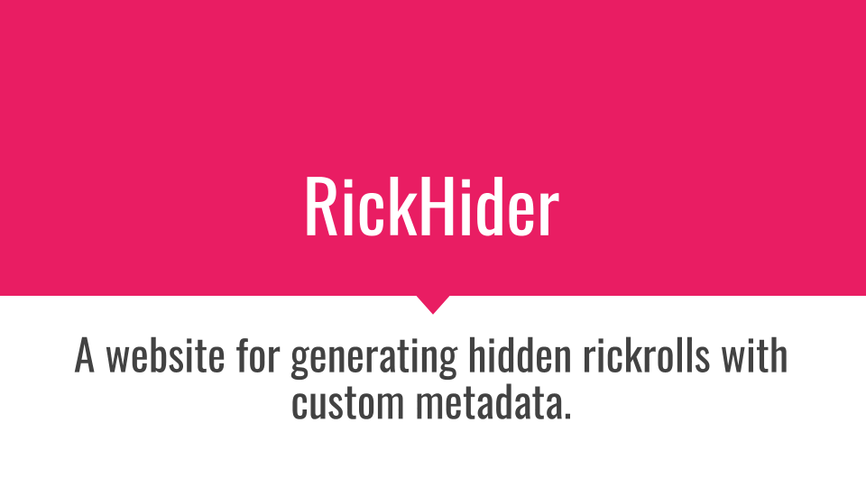

# RickHider

[https://rickhider.herokuapp.com](https://rickhider.herokuapp.com)

A website for generating hidden rickrolls with custom metadata. Enter an optional custom title, description, and thumbnail image into the website and RickHider will generate a shortened link to send to your unsuspecting victim. When the victim clicks the link, they will be redirected to a rickroll. RickHider uses custom SEO metadata to change how the link is displayed on social media websites.

## License
**rickhider** is licensed under the [Apache License 2.0](https://github.com/willuhm-js/RickHider/blob/main/LICENSE).
